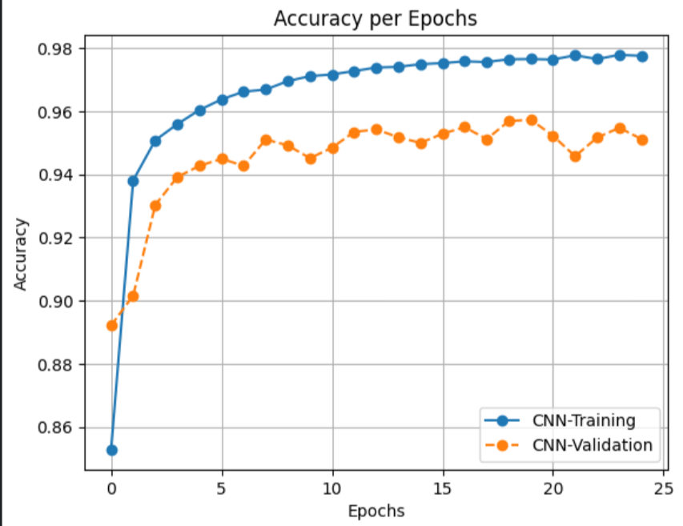
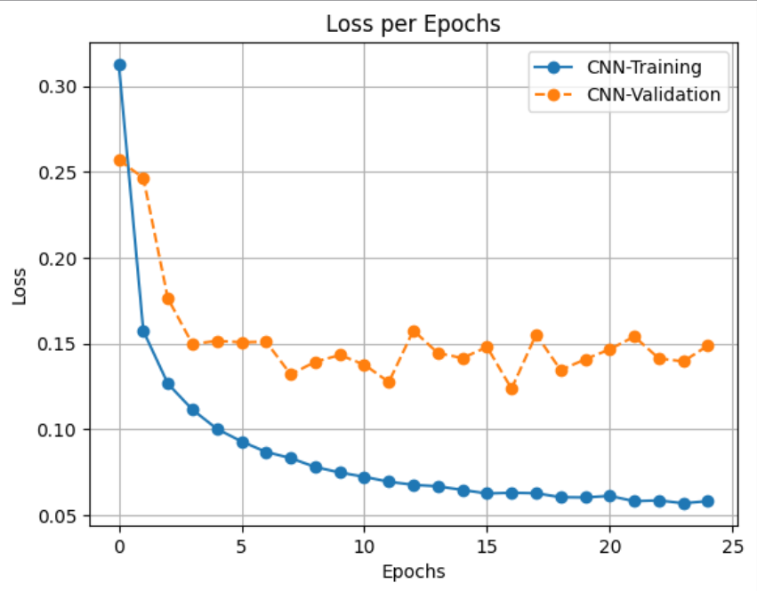
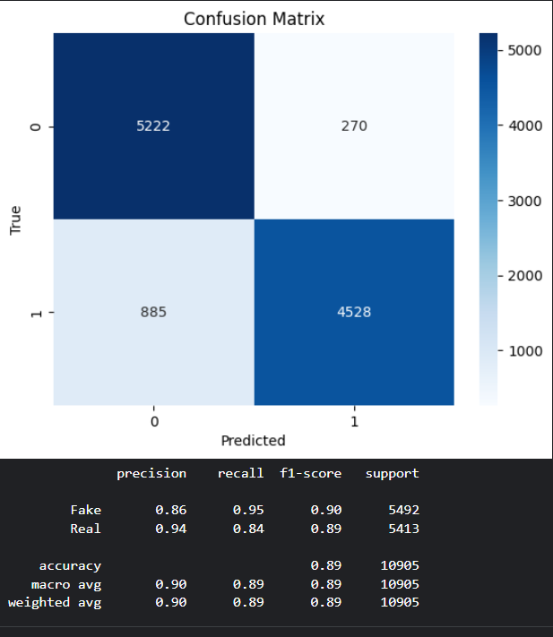
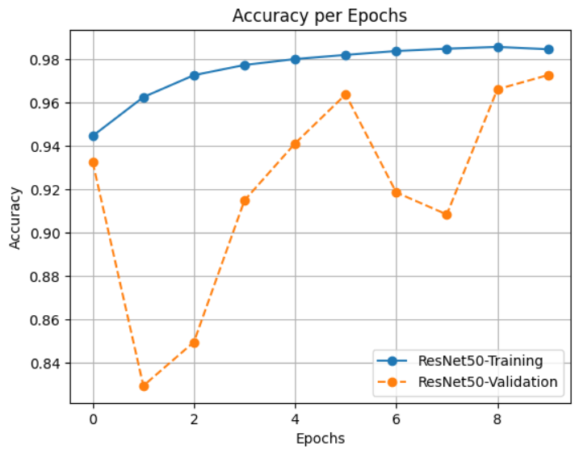
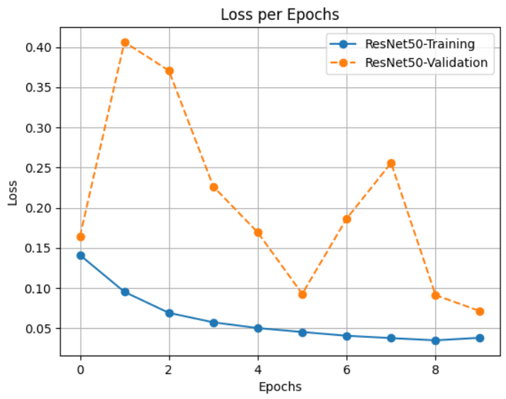
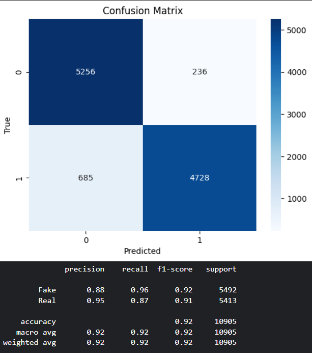

# DeepFake-vs-Real-Image-Classification

## 📌 Overview

This project focuses on binary classification of images to distinguish between DeepFake and Real images.
Two different CNN approaches were implemented:
  - Custom 5-layer CNN (baseline model).
  - Transfer Learning using ResNet50 pretrained on ImageNet.

The project also integrates evaluation metrics, confusion matrices, and Grad-CAM visualizations to interpret model predictions.

## 📂 Dataset

- Source: [DeepFake and Real Images Dataset on Kaggle](https://www.kaggle.com/datasets/manjilkarki/deepfake-and-real-images/data).
- Images resized to 256 × 256 × 3.
- Data augmentation applied (rescaling, horizontal flips).

## 🏗️ Methodology

1. Custom CNN (Baseline)
  - 5 convolutional layers with ReLU activation & max-pooling.
  - Fully connected dense layer with dropout for regularization.
  - Output layer with sigmoid activation for binary classification.
  - Optimizer: Adam
  - Loss: Binary Crossentropy

2. ResNet50 (Transfer Learning)
  - Pretrained ResNet50 with include_top=False.
  - Added custom head:
    - Global Average Pooling
    - Dense (512 units, ReLU)
    - Batch Normalization
    - Dropout (0.3)
    - Dense(1, sigmoid)
  - Fine-tuned on training dataset.

## ⚙️ Training Setup

- Batch size: 32
- Image size: 256×256
- Optimizer: Adam
- Loss function: Binary Crossentropy
- Callbacks:
    - ModelCheckpoint (save best model)
    - EarlyStopping (patience = 5)

## 📊 Results
Custom CNN
  - Training accuracy: ~97.68%
  - Validation accuracy: ~95.73% 
  - Loss: ~0.1407 (val)
    
| CNN Accuracy | CNN Loss |
|------------|------------|
|  |  |

**Confusion Matrix and Classification Report** 
 

ResNet50
  - Training accuracy: ~98.69%
  - Validation accuracy: ~97.28%
  - Loss: ~0.071 (val)

| ResNet50 Accuracy | ResNet50 Loss |
|------------|------------|
|  |  |

**Confusion Matrix and Classification Report** 
 

## 🎨 Explainability with Grad-CAM

Grad-CAM was applied on ResNet50 predictions to visualize important regions of the image influencing the decision.
Pipeline:
Extract gradients from last convolutional layer.
Generate class activation heatmap.
Overlay heatmap on original image.

## 📌 Future Improvements
  - Experiment with ConvNeXt, EfficientNet, or ViT.
  - Try data augmentation techniques like rotation, brightness, zoom.
  - Perform fine-tuning on deeper layers of ResNet50.
  - Deploy model as a web app with Flask/Streamlit.
